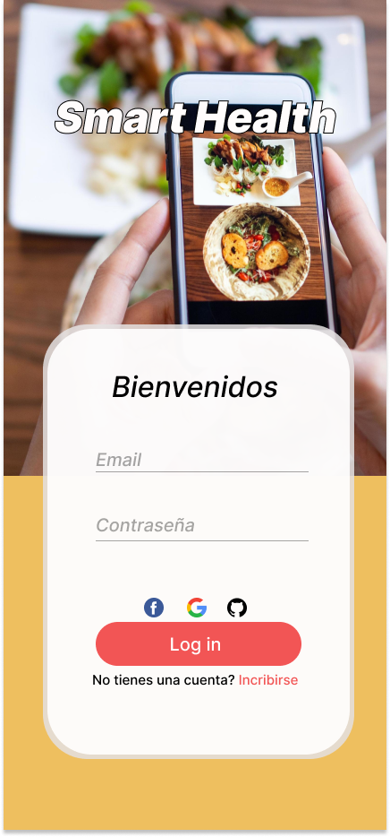
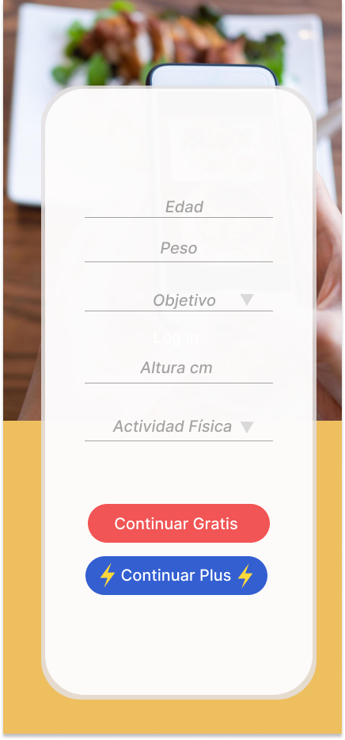
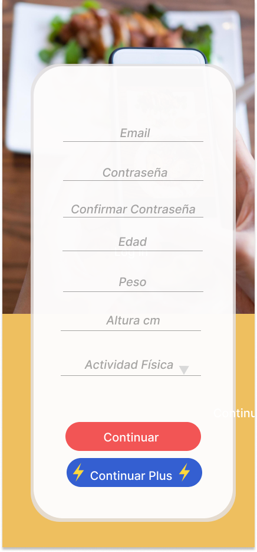
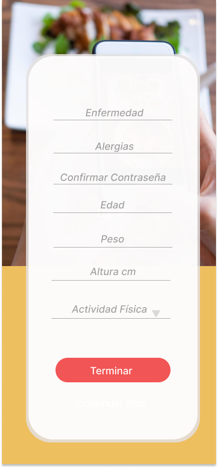
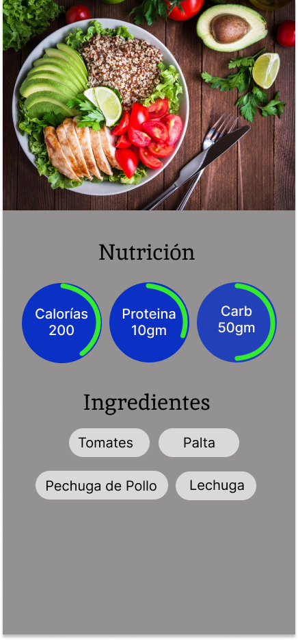

<h1 align="center">Smart Health</h1>

  

**Smart Health** es una aplicación móvil diseñada para brindar a los usuarios una experiencia integral de salud y bienestar. Con una amplia gama de características y funcionalidades, nuestra aplicación se esfuerza por ayudar a las personas a llevar un estilo de vida más saludable y tomar el control de su bienestar.

## Modelado del desarrollo

  
  
  
  

  
  
  

## Características Principales

### Registro y Perfil de Usuario
- Regístrate y crea tu perfil con información personal, incluyendo nombre, apellido, correo, contraseña, edad, peso, altura y actividad física.

### Comidas Recomendadas
- Recibe recomendaciones de comidas saludables adaptadas a tus preferencias y necesidades nutricionales.

### Registro de Platos
- Registra descripciones e ingredientes de tus platos favoritos para mantener un registro de tus opciones alimenticias.

### Información Nutricional
- Accede a información detallada sobre la información nutricional de los platos que has registrado.

### VIP con Membresía
- Desbloquea la membresía VIP para acceder a funciones avanzadas:
  - Agrega datos adicionales, como sexo y enfermedades.
  - Realiza análisis de sangre para medir hemoglobina, colesterol y pulsos cardiacos.
  - Recibe dietas y rutinas de ejercicios personalizadas por parte de un nutricionista.

### Validación Médica y Nutricional
- Interactúa con médicos o nutricionistas a través de la interfaz de la aplicación para validar las recomendaciones generadas por nuestra inteligencia artificial.

## Ideas Futuras de Escalamiento

- Integración de Pulseras de Salud: Conecta dispositivos de seguimiento de salud para medir parámetros adicionales y recibir recomendaciones más precisas.
- Validación por Expertos: Ofrece un servicio premium donde expertos en salud validen y ajusten las recomendaciones personalizadas.

## Contribuciones y Desarrollo

¡Estamos entusiasmados de recibir contribuciones de la comunidad! Si deseas colaborar en el desarrollo de Smart Health, no dudes en contactarnos.

## Contacto

Gutierrez Arratia Ronald Romario
 

Miguel Angel Deza Cuela
 

Roy Angel Choquehuanca Anconeyra
 

Diego Raul Rivas Huanca
 
 
¡Gracias por elegir Smart Health y por cuidar tu bienestar!
